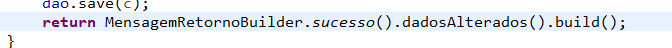
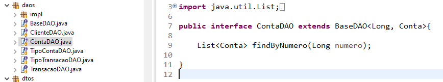
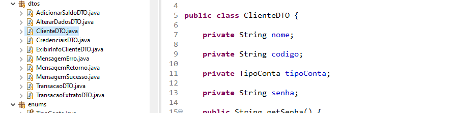
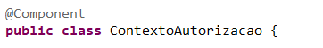
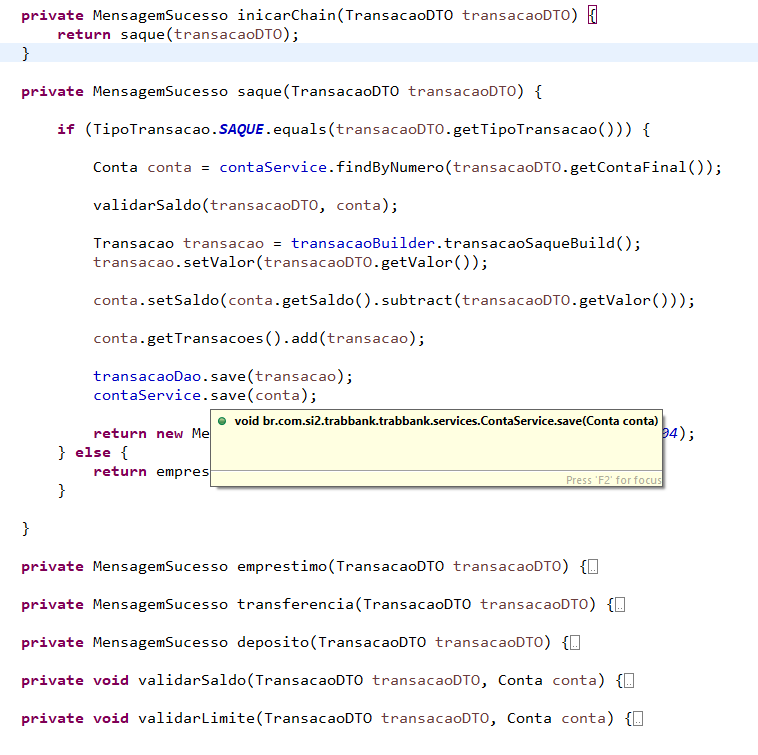
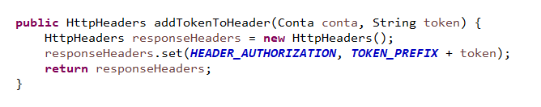

<h1>Trab Bank</h1>

Casos de uso e video disponiveis em: <a href="https://drive.google.com/drive/folders/1yNIEybakDNf_AyRnBcVqe7C_sxsFCt26?usp=sharing">link</a>

Swagger com aplicação rodando: <a href="http://localhost:8080/swagger-ui.html">link</a>

<h2>Padrões de projeto</h2>

<h3>1 Builder</h3>

    Implementado durante a construção de um cliente 

 

<h3>2 DAO</h3>

    DAO para lidar com o acesso ao banco e manipulação das entendodades 

 
 

<h3>3 DTO</h3>

    DTO para transferir dados 

 
 

<h3>4 MVC</h3>

    A arquitetura do projeto utiliza MVC 

<!--  
  -->

<h3>5 Stateless</h3>

    O @Bean do spring boot implementa o padrão stateless 

<h3>6 Factory</h3> 

    Implementado para entregar uma instancia de conta dependendo do tipo passado como argumento.

Para criação de uma conta
 

<h3>7 Chain of Responsibility</h3>

    A chor identifica qual o metodo deve tratar a solicitação de transação 

 
 

<h3>7.1 Chain of Responsibility</h3>

    Utilizado para ter acesso a cadeia de requisição e a partir HttpHeaders que é o handler colocar o token no header 

 
 
